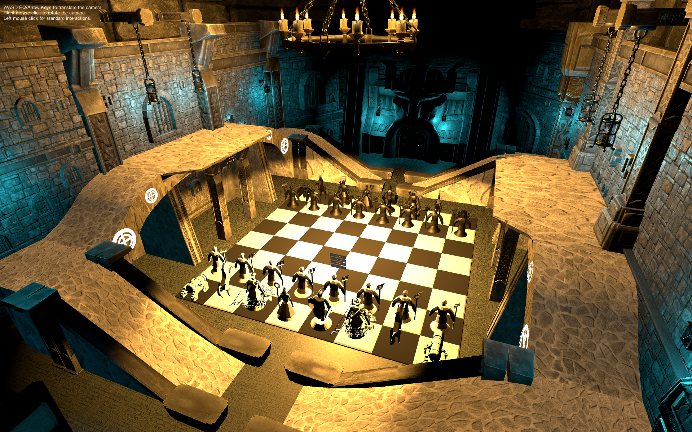
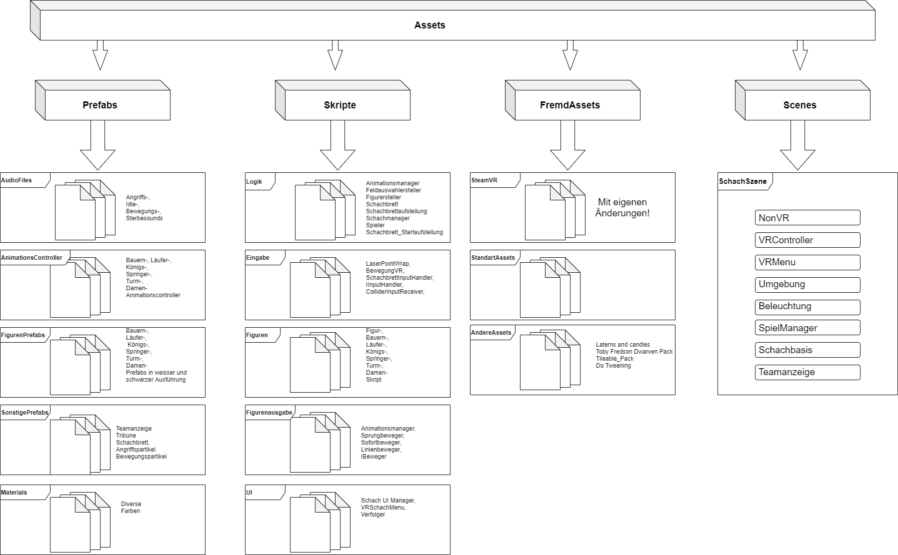
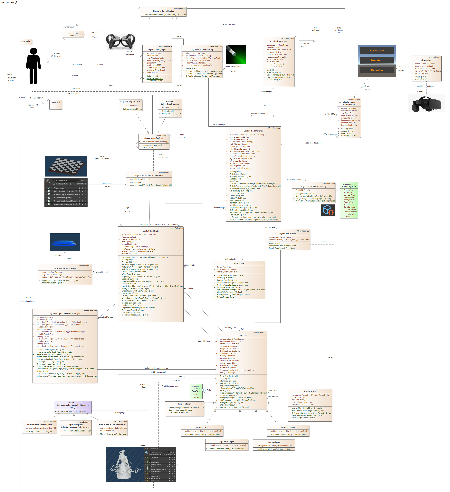

# ♜ VR-Chess – A Dungeon Duel in Virtual Reality

Step into the dungeon and prepare for a magical battle of minds: **VR Chess** brings classic chess into immersive 3D.  
Move pieces, watch them fight, and experience the game like never before – all in **VR with Oculus**.

---

## 🎓 Project & Context

We developed **VR Chess** during the **"Virtual Reality and Animation"** course at **Aalen University**.  
The goal was to create an immersive and interactive VR experience – and what better way than with epic dungeon chess?

This was a 3-person passion project combining:

- 🧠 **3D Modeling & Animation** (Blender)
- 🛠️ **Game Programming** (Unity / C#)
- 🧪 **Testing & Balancing**
- 🎨 **Level & FX Design**

> All 3D models, board elements and gameplay logic were developed in Unity and Blender.
> For playing we implemented against an oculus quest vr headset.

---

## 🕹️ Gameplay Mechanics

Step into a medieval dungeon and play a mystical game of chess like never before.  
With full VR locomotion and interactive chess pieces, players can:

- **Explore** the board in VR using teleportation
- **Select and command** chess pieces with hand tracking or controller
- **Trigger dynamic animations** during attacks
- **Local PvP** – take turns playing on the same headset

This is **not just chess** – this is **Dungeon Chess Duel**.

---

## 🏗️ Game Design

### ♟️ Chess Pieces – Fully Modeled & Animated

Each chess piece was **modeled from scratch in Blender** and rigged with custom animations:

- **Idle animation** (when selected)
- **Move animation** (when repositioned)
- **Attack animation** (when taking an opponent)
- **Death animation** (when defeated)

  

> The **attack sequences** are also choreographed!  
> When a piece captures another:
> - Both pieces face each other
> - Attacker performs its animation
> - Victim reacts with a death animation
> - The attacker takes its new position

| Queen | King |
|:--:|:--:|
| |  |

| Bishop | Knight |
|:--:|:--:|
|  |  |

|              Rook              | Pawn |
|:------------------------------:|:--:|
|  |  |

### 🖼️ Visuals & Environment

We wanted to create a dark, cool atmosphere for the surroundings.
For the decorations like walls, chandeliers, and ceiling
we used assets from open source libraries.

Interactive elements like the stage, the chessboard and the
team display were modeled ourselves using blender.

  
  

---

## 🔧 Technologies & Design

- 🎮 Unity (C#)
- 📊 Steam VR Plugin
- 🎞️ Custom animation scheduler for timed actions

A brief overview of the project structure can be seen in the diagrams below:

  

  

The correspondig .eapx file (Enterprise Architect) can be found [here](docs/VR_Doku_Enterprise_Architect.eapx).

---

## More information

For more information there is also a full project documentation in german.
For a brief outline of the project have a look at the german game kickoff and release presentation.

📜 [Start-Presentation GER (PDF)](docs/VR-Schachspiel-Startpräsentation.pdf)

📜 [End-Presentation GER (PDF)](docs/VR-Schachspiel-Endpräsentation.pdf)

📜 [Documentation GER (PDF)](docs/VR_Dokumentation.pdf)

---

## 🧑‍💻 Teamwork makes the Dream Work

Developed by:

- Simon Ruttmann
- Veronika Scheller
- Michael Ulrich

---

## 📜 License

This project is licensed under the [Apache 2.0 License](LICENSE).  
Feel free to use or remix it – just give proper credit. 🤝

---

## 📦 Downloads & Releases
Want to play?

➡️ **[Click here to download the latest release](https://github.com/SimonRuttmann/VR-Chess-Dungeon/releases/tag/v1.0.0)**

---

## 🖼️ Media Gallery

🎬 [Watch Full Gameplay Walkthrough (MKV)](media/video/walkthrough.mkv)

---

