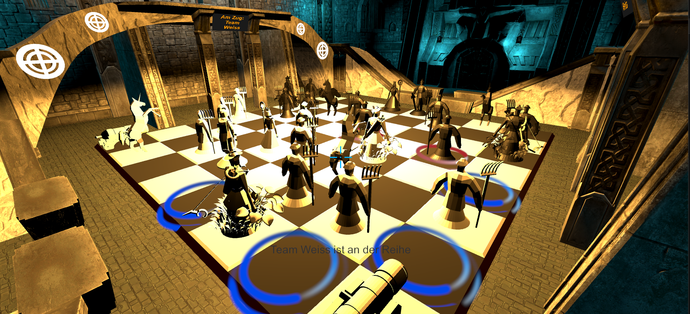
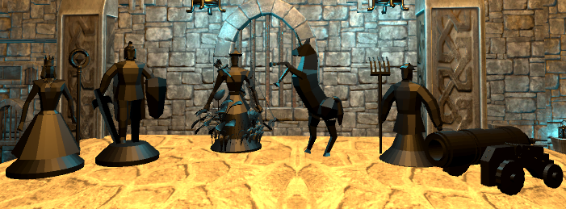
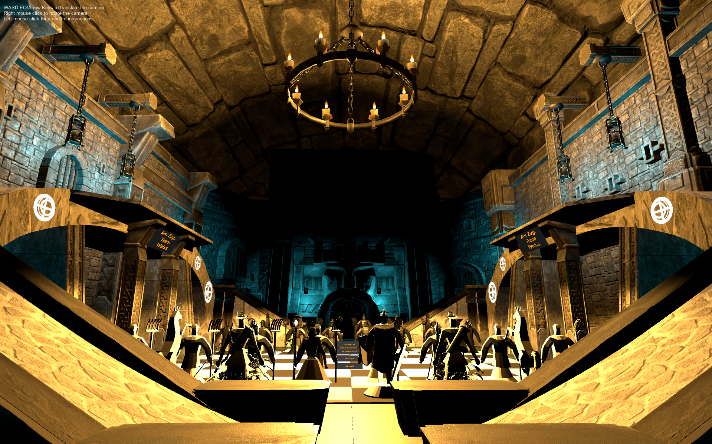

# 🏰 VR Chess – Dungeon Chess Duel

> A virtual reality chess experience in a magical dungeon – inspired by *Harry Potter and the Philosopher's Stone*.  
> Designed for **Oculus Quest** – fully animated pieces, immersive interactions, and dungeon vibes.

---

## 🎓 Project & Context

**VR Chess** was developed during the **"Virtual Reality and Animation"** course at **Aalen University**.  
The goal was to create an immersive and interactive VR experience – and what better way than with epic dungeon chess?

Created by:

- **Simon Ruttmann**
- **Veronika Scheller**
- **Michael Ulrich**

> All 3D models, board elements, and gameplay logic were developed in Unity and Blender.

---

## 🧠 Core Concept

Step into a medieval dungeon and play a mystical game of chess like never before.  
With full VR locomotion and interactable chess pieces, players can:

- **Explore** the board in VR
- **Select** chess pieces with hand tracking or controller
- **View attack & move indicators** (blue/red markers)
- **Trigger dynamic animations** during attacks
- **Play locally** against a friend (no network/AI)

This is **not just chess** – this is **Dungeon Chess Duel**.

---

## 🏗️ Game Design

### ♟️ Chess Pieces – Fully Modeled & Animated

Each chess piece was **modeled from scratch in Blender** and rigged with custom animations:

- **Idle animation** (when selected)
- **Move animation** (when repositioned)
- **Attack animation** (when taking an opponent)
- **Death animation** (when defeated)

> Even the **attack sequences** are choreographed!  
> When a piece captures another:
> - Both pieces face each other
> - Attacker performs its animation
> - Victim reacts with a death animation
> - The attacker takes its new position

| Queen | Bishop | Knight | Rook | King | Pawn |
|:--:|:--:|:--:|:--:|:--:|:--:|
|  |  |  |  |  |  |

---

## 🕹️ Gameplay Mechanics

- **Local PvP** – take turns playing on the same headset
- **Immersive VR locomotion** – walk around the board to get close-up views
- **Interactive selection** – choose and move pieces naturally
- **Visual feedback** – move & attack markers are shown in blue/red
- **Dynamic chess arena** – torches, chandeliers, stone walls create the atmosphere

🎬 Full walkthrough:  
[▶️ Watch 3-min walkthrough (MKV)](media/video/Walkthrough.mkv)

---

## 🖼️ Visuals & Environment

- **Chess board**: custom-modeled and textured
- **Environment**: designed dungeon interior with hand-made textures
- **Assets**: walls, chandeliers, and ceiling from external sources
- **Team HUD**: display team turns and interactions

|  |  |
|---|---|

> Created using **Unity + Blender**, optimized for Oculus Quest.

---

## 🗂️ Project Structure

Here's an overview of the folder structure and organization:

---

## 🧑‍💻 Teamwork Makes the Dream Work

This was a 3-person passion project combining:

- 🧠 **3D Modeling & Animation** (Blender)
- 🛠️ **Game Programming** (Unity / C#)
- 🧪 **Testing & Balancing**
- 🎨 **Level & FX Design**

We had a blast designing, animating, and refining every piece.

---

## 📜 License

This project is licensed under the [Apache 2.0 License](LICENSE).  
Feel free to use or remix it – just give proper credit. 🤝

---

## 📦 Downloads & Releases

➡️ **[Download the latest release](https://github.com/SimonRuttmann/VR-Chess-Dungeon/releases/tag/v1.0.0)**

Included in the release:

- ✅ Unity build files
- ✅ Full Blender models of all pieces
- ✅ VR-ready scenes and prefabs
- ✅ All animations and controller setups
- ✅ Demo walkthrough video

---

## 🖼️ Media Gallery

🎬 [Watch Full Gameplay Walkthrough (MKV)](media/video/Walkthrough.mkv)

|  |  |
|---|---|
|  |  |

---

